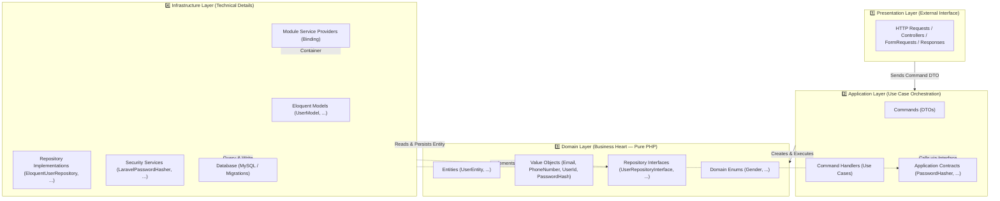
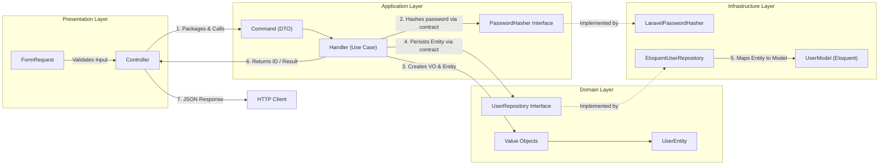
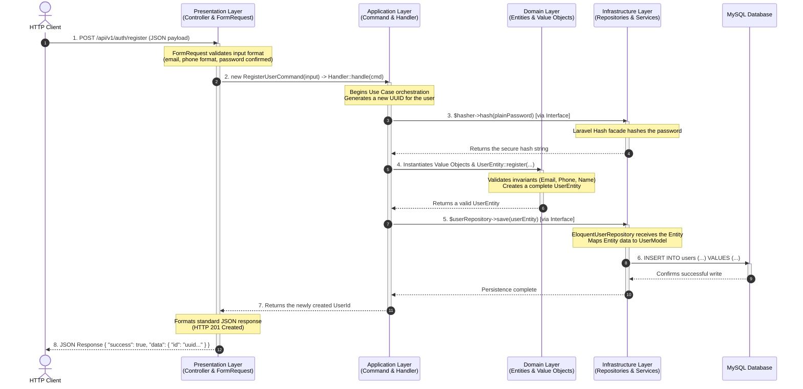

# 🏗️ Domain-Driven Design (DDD) Architecture with Laravel (Modular Monolith)

This document consolidates the philosophy, core concepts, architectural rules, and inter-layer communication patterns for the **E-Commerce Scaling** project, built as a **Modular Monolith combined with Domain-Driven Design (DDD)** on top of Laravel.

---

## 📋 Table of Contents

1. [Architectural Overview](#1--architectural-overview)
2. [Layer Responsibilities](#2--layer-responsibilities)
3. [Core Architecture Rules](#3--core-architecture-rules)
4. [Inter-Layer Communication](#4--inter-layer-communication)
5. [Request Lifecycle (Sequence Diagram)](#5-️-request-lifecycle-sequence-diagram)
6. [Folder Structure by Bounded Context](#6--folder-structure-by-bounded-context)
7. [Quick Reference: Do's & Don'ts](#7--quick-reference-dos--donts)

---

## 1. 🔭 Architectural Overview

The system follows a layered, domain-centric architecture (Onion / Hexagonal / Clean Architecture), based on one core principle:

> **The core business logic (Domain) sits at the center. Every technical detail — framework, database, third-party services — is just supporting Infrastructure.**



---

## 2. 🧩 Layer Responsibilities

| Layer                                           | ✅ Responsibilities                                                                                                                                                                                                                                                                                                                                         | 🚫 Must NEVER Do                                                                                                                                                          |
| ----------------------------------------------- | ----------------------------------------------------------------------------------------------------------------------------------------------------------------------------------------------------------------------------------------------------------------------------------------------------------------------------------------------------------- | ------------------------------------------------------------------------------------------------------------------------------------------------------------------------- |
| **🌐 Presentation**<br>_Interface Layer_        | • Receives HTTP requests from clients<br>• Validates input format (FormRequest)<br>• Packages valid input into a Command DTO<br>• Calls the Use Case Handler in the Application layer<br>• Formats the output data and HTTP status code (JSON response)                                                                                                     | • Contain business logic<br>• Call Eloquent Models or the database directly<br>• Hash passwords, manage transactions, or dispatch Domain Events                           |
| **⚙️ Application**<br>_Orchestration Layer_     | • Acts as the Use Case / workflow orchestrator<br>• Receives an immutable Command DTO from Presentation<br>• Generates IDs, calls technical services via interfaces<br>• Instantiates Entities and Value Objects from the Domain<br>• Persists Entities through Repository Interfaces<br>• Manages application-level transactions and returns a safe ID/DTO | • Know storage details (SQL, Eloquent queries)<br>• Depend on the HTTP request/response or session<br>• Hold state across multiple requests (use cases must be stateless) |
| **💎 Domain**<br>_Business Heart_               | • Contains all core business rules<br>• Guarantees integrity (invariants) via Entities & Value Objects<br>• Defines Repository Interfaces (storage contracts)<br>• Is **100% pure PHP**, fully independent of any framework                                                                                                                                 | • Import any class from Laravel/Eloquent (`use Illuminate\...;`)<br>• Import classes from Application or Infrastructure<br>• Perform I/O (database, queue, HTTP client)   |
| **🔧 Infrastructure**<br>_Technical Foundation_ | • Implements the interfaces defined by Domain and Application<br>• Manages Eloquent Models, database migrations, cache, mail, queue<br>• Maps between Domain Entities and database records<br>• Provides Module Service Providers to bind interfaces to implementations                                                                                     | • Contain core business rules<br>• Leak Eloquent Models out to Presentation or Application                                                                                |

---

## 3. 📐 Core Architecture Rules

### Rule 1 — One-Way Dependency

$$\text{Presentation} \longrightarrow \text{Application} \longrightarrow \text{Domain} \longleftarrow \text{Infrastructure}$$

- 🎯 **Domain is the center** — the most independent layer. It depends on nothing.
- 🔗 **Application depends on Domain** — Application knows the Domain well (uses Entities, Value Objects, Repository Interfaces), but the Domain knows nothing about Application.
- 🔌 **Infrastructure depends on Domain & Application** — Infrastructure is the "technical servant," implementing the interfaces defined by Domain and Application.
- 🚪 **Presentation only talks to Application** — Presentation must never skip Application to call a Repository or Entity directly.

### Rule 2 — The Domain Layer Is Pure PHP (Framework-Agnostic)

- Inside `domain/`, there must be **zero** Laravel namespaces (`Illuminate\...`) or facades (`Hash`, `DB`, `Route`, ...).
- If you migrate the project from Laravel to Symfony or gRPC tomorrow, **the Domain layer stays 100% unchanged.**

### Rule 3 — Protect Integrity with Value Objects & Entities

- **Value Object (VO)**: represents a value, immutable, self-validating at creation time (`Email`, `PhoneNumber`, `UserId`, `PasswordHash`). Once a VO exists, it is **guaranteed 100% valid**.
- **Entity**: has a unique identity (`UserId`) and protects business rules whenever its state changes. All constructors are `private`; instances can only be created via static factory methods (`UserEntity::register(...)`).

---

## 4. 🔄 Inter-Layer Communication



### 1️⃣ Presentation → Application

- **How**: via a **Command DTO** (e.g. `RegisterUserCommand`).
- **Details**: a Command is a `final readonly class` holding primitive data already validated by FormRequest. It behaves like a sealed letter — untouched along the way.

### 2️⃣ Application → Domain

- **How**: directly instantiates **Value Objects** (`Email::from(...)`, `PhoneNumber::from(...)`) and calls the Entity's business methods (`UserEntity::register(...)`).
- **Details**: Application fully understands the Domain. It prepares complete Value Objects and hands them to the Entity for one final invariant check.

### 3️⃣ Application → Infrastructure

- **How**: via **Dependency Inversion** (contracts/interfaces).
- **Details**: Application never calls `LaravelPasswordHasher` or `EloquentUserRepository` directly. It only injects interfaces (`PasswordHasher`, `UserRepositoryInterface`). At runtime, Laravel's Service Container automatically injects the concrete Infrastructure class.

### 4️⃣ Infrastructure ↔ Domain

- **How**: two-way in terms of data, one-way in terms of dependency:
    - **Write path (Persistence)** — Infrastructure receives a `UserEntity` via `save(UserEntity $user)`, reads its Value Objects through getters, and converts them into database records.
    - **Read path (Hydration)** — Infrastructure reads a database record via the Eloquent Model, then reconstructs the original `UserEntity` before returning it to Application.

### 5️⃣ Application → Presentation

- **How**: returns an **Identifier** (`UserId`) or a safe **Response DTO**.
- **Details**: **Never** return the raw `UserEntity` to Presentation — doing so risks leaking sensitive data (like `passwordHash`) into the API response.

---

## 5. ⏱️ Request Lifecycle (Sequence Diagram)

Below is the sequence diagram showing the path of a registration request from entry to response:



---

## 6. 📁 Folder Structure by Bounded Context

Each major feature/business capability (Bounded Context) is packaged in a consistent module structure:

```
├── presentation/               # HTTP / CLI Interface Layer
│   ├── User/
│   │   ├── Controllers/        # RegisterController.php
│   │   ├── Requests/Auth/      # UserRegisterRequest.php
│   │   └── Routes/             # auth.php
│   └── Shared/                 # BaseController, ResponseHelper
│
├── application/                # Use Case Orchestration Layer
│   └── User/
│       ├── Commands/           # RegisterUserCommand.php (Input DTO)
│       ├── Handlers/           # RegisterUserHandler.php (Use Case)
│       ├── Contracts/          # PasswordHasher.php (Application Interface)
│       └── DTOs/               # Response DTOs (if any)
│
├── domain/                     # Core Business Layer (Pure PHP)
│   └── User/
│       ├── Entities/           # UserEntity.php
│       ├── ValueObjects/       # UserId.php, Email.php, PhoneNumber.php, PasswordHash.php
│       ├── Repositories/       # UserRepositoryInterface.php (Domain Contract)
│       └── Enum/               # Gender.php
│
└── infrastructure/             # Technical Foundation & Implementation Layer
    ├── User/
    │   ├── Models/             # UserModel.php (Eloquent Model)
    │   ├── Repositories/       # EloquentUserRepository.php (Repository Implementation)
    │   ├── Security/           # LaravelPasswordHasher.php
    │   └── Providers/          # UserInfrastructureServiceProvider.php (Module Bindings)
    ├── Databases/Migrations/   # Migration files creating tables
    └── Providers/              # InfrastructureServiceProvider.php (Shared infra loader)
```

---

## 7. ✅❌ Quick Reference: Do's & Don'ts

| ✅ DO                                                                            | 🚫 NEVER DO                                                                        |
| -------------------------------------------------------------------------------- | ---------------------------------------------------------------------------------- |
| Keep classes in `domain/` completely free of `use Illuminate\...;`               | Put Eloquent Models or database queries inside the Domain                          |
| Use `readonly class` with `public` properties for Command DTOs                   | Write verbose getters/setters for immutable DTOs                                   |
| Pass a `PasswordHash` VO into `UserEntity`, letting Application do the hashing   | Inject a hasher directly or call `Hash::make()` inside the Entity                  |
| Inject `UserRepositoryInterface` into `RegisterUserHandler`                      | Type-hint the concrete `EloquentUserRepository` class in the Handler               |
| Split Service Providers per module (`UserInfrastructureServiceProvider`)         | Dump hundreds of interface bindings into one giant `InfrastructureServiceProvider` |
| Always create a fresh Query Builder (`$this->model->newQuery()`) in Repositories | Reuse the `$this->model` instance, leaking stray `where` conditions                |
| Return a safe `UserId` or `ResponseDTO` to the Controller                        | Return the raw `UserEntity` to the Controller, exposing the password hash          |
