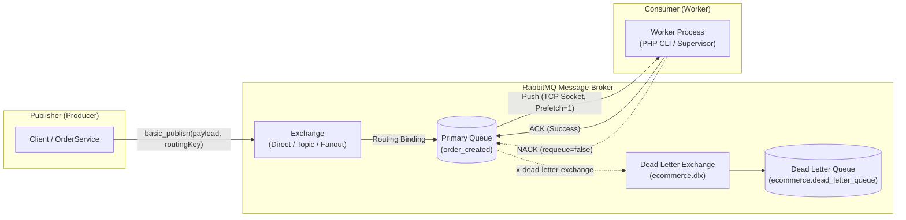
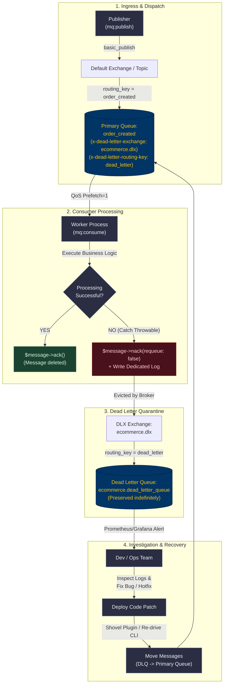
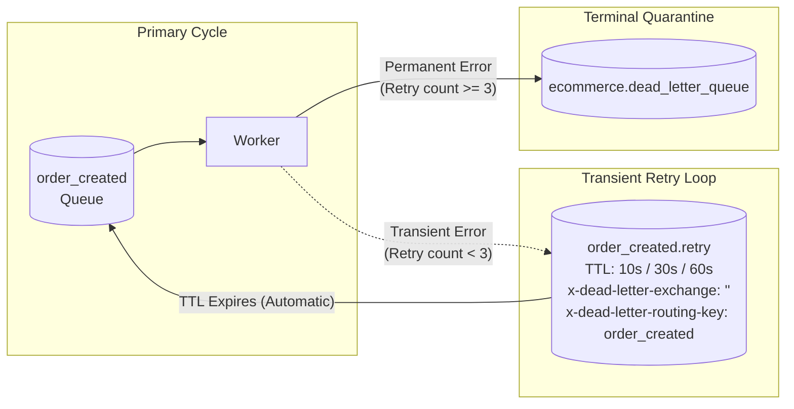

# 🐇 Infrastructure Architecture: RabbitMQ Message Broker & Resilient Event-Driven System

> **Author:** Nguyen Huu Dai \
> **Role:** Backend Engineer \
> **Architecture Style:** Modular Monolith (Domain-Driven Design) \
> **Document Type:** Technical Architecture & Infrastructure Specification \
> **Status:** Implemented & Verified \
> **Last Updated:** September 16, 2026

---

## 📋 Table of Contents

1. [Executive Summary & System Context](#1--executive-summary--system-context)
2. [Broker Comparison: Why RabbitMQ?](#2--broker-comparison-why-rabbitmq)
3. [Core AMQP 0-9-1 Concepts & Mechanics](#3--core-amqp-0-9-1-concepts--mechanics)
4. [Message Lifecycle: ACK vs NACK Deep Dive](#4--message-lifecycle-ack-vs-nack-deep-dive)
5. [Resilience Patterns: DLX, TTL & Automatic Retry](#5--resilience-patterns-dlx-ttl--automatic-retry)
6. [Codebase Architecture & Clean DDD Implementation](#6--codebase-architecture--clean-ddd-implementation)
7. [Operational Guide: Verification, Shovel & CLI Commands](#7--operational-guide-verification-shovel--cli-commands)
8. [Frequently Asked Architectural Questions (FAQ)](#8--frequently-asked-architectural-questions-faq)

---

## 1. 🎯 Executive Summary & System Context

### 1.1. The Scaling Challenge in E-Commerce

In a high-throughput E-Commerce system, a single customer action (such as **Placing an Order**) triggers multiple downstream side-effects:

- Deducting inventory in the Warehouse module.
- Processing financial transactions / Payment settlement.
- Sending transactional notifications (Email, SMS, Push notification).
- Generating invoices and syncing with third-party logistics (3PL).

If these tasks are executed **synchronously** within the HTTP Request lifecycle:

- **High Latency:** User must wait 2–5 seconds for all third-party APIs and DB transactions to complete.
- **Cascading Failures:** If the Email service or Logistics API times out, the entire checkout transaction fails, degrading user conversion rates.
- **Resource Contention:** Long-running HTTP threads exhaust the Web Server / PHP-FPM process pool, leading to `504 Gateway Timeout` and server crashes under traffic spikes (e.g., Flash Sales).

### 1.2. The Solution: Asynchronous Event-Driven Decoupling

By introducing **RabbitMQ** as a central message broker:

1. The API controller commits the core order record and publishes an `OrderCreated` domain event in **< 5ms**, immediately returning HTTP `200/201` to the client.
2. Background worker processes (Consumers) independently consume events from isolated queues at a sustainable pace, shielded from web traffic spikes.
3. Errors are isolated and governed by **Dead Letter Exchanges (DLX)** and **Retry policies**, guaranteeing **At-Least-Once Delivery** without data loss.

---

## 2. ⚖️ Broker Comparison: Why RabbitMQ?

Why did we choose **RabbitMQ** over Apache Kafka, Redis Streams, or native Laravel Queues for our Modular Monolith?

### 2.1. Comparison Matrix

| Criteria                   | RabbitMQ (AMQP 0-9-1)                                           | Apache Kafka                                                  | Redis Streams / List                          | Laravel Native Queue (`queue:work`)   |
| :------------------------- | :-------------------------------------------------------------- | :------------------------------------------------------------ | :-------------------------------------------- | :------------------------------------ |
| **Architectural Model**    | **Smart Broker, Dumb Consumer** (Broker routes & tracks status) | **Dumb Broker, Smart Consumer** (Distributed Append-Only Log) | In-Memory Data Structure                      | Internal Task/Job Queue               |
| **Payload Format**         | **Language-Agnostic Pure JSON**                                 | Language-Agnostic (Avro, JSON, Protobuf)                      | Key-Value String / Hash                       | **PHP-Serialized Class** (`O:28:...`) |
| **Polyglot Microservices** | **Excellent** (Python, Go, Node.js can easily consume)          | **Excellent**                                                 | Moderate                                      | **Poor** (Locked strictly to PHP)     |
| **Routing Flexibility**    | **Very High** (Direct, Topic, Fanout, Headers, DLX)             | Partition Key / Topic based                                   | Channel / Key based                           | Queue name based                      |
| **Message Durability**     | Disk-persisted (`durable=true`, `delivery_mode=2`)              | Disk-persisted commit log                                     | Memory-first with RDB/AOF sync                | Database / Redis dependent            |
| **Acknowledgment & QoS**   | Per-message manual ACK/NACK + Prefetch Count                    | Consumer offset commit                                        | Manual ACK (XACK)                             | Worker job delete / fail              |
| **Dead-Letter Handling**   | **Native Protocol Support (DLX/DLQ)**                           | Manual topic routing                                          | Manual implementation                         | `failed_jobs` table                   |
| **Primary Use-Case**       | **Transactional Workflows, Complex Routing, E-Commerce Events** | Big Data, Stream Processing, Log Ingestion, Event Sourcing    | Cache-aside, Rate Limiting, Ephemeral pub/sub | Simple PHP monolith background jobs   |

### 2.2. Decision Rationale

1. **Business-Grade Transactional Semantics:** Unlike Kafka which is built for high-throughput streaming (millions of metrics/sec) where replaying offsets is primary, RabbitMQ excels at **discrete transactional tasks** (Orders, Payments, Emails) where individual message acknowledgment, rejection, and dead-letter routing are paramount.
2. **Freedom from PHP Lock-in:** Unlike Laravel's native queue driver which serializes PHP objects, our custom RabbitMQ layer uses standard JSON payloads. Downstream services written in Go, Rust, or Python can seamlessly subscribe to the same exchanges.
3. **Enterprise Routing Capabilities:** RabbitMQ's support for Topic Exchanges, wildcard routing keys, and Dead Letter Exchanges allows fine-grained event distribution without changing producer logic.

---

## 3. 🧩 Core AMQP 0-9-1 Concepts & Mechanics



### 3.1. Fundamental AMQP Components

1. **Producer (Publisher):** The application component that emits domain events. It sends messages to an Exchange, **never directly to a Queue**.
2. **Exchange:** The routing engine inside RabbitMQ. Inspects message metadata and routing keys to decide which queue(s) receive the message:
    - **Default Exchange (`""`):** A pre-declared direct exchange where messages are routed to the queue whose name exactly matches the `routing_key`.
    - **Direct Exchange:** Routes messages to queues based on an exact routing key match.
    - **Topic Exchange:** Routes messages based on wildcard routing keys (e.g., `order.*`, `payment.#`).
    - **Fanout Exchange:** Broadcasts messages to all bound queues indiscriminately (Pub/Sub).
3. **Queue:** A disk-backed, sequential FIFO buffer that holds messages until consumers process them.
4. **Binding:** The relationship/link between an Exchange and a Queue, governed by a routing key.
5. **Consumer (Worker):** A persistent background process connected to RabbitMQ that consumes and processes messages.

### 3.2. Critical Infrastructure Caveats

- **Protocol Locale vs Laravel Locale:** In `AMQPStreamConnection`, the `$locale` argument (default `'en_US'`) is an **AMQP protocol handshake parameter** (defined in AMQP 0-9-1 spec) used for server-to-client technical protocol error negotiation by the Erlang broker, **NOT** the Laravel application UI locale (`APP_LOCALE=en`).
- **Persistent Delivery Mode:** Messages must be published with `delivery_mode = AMQPMessage::DELIVERY_MODE_PERSISTENT` (value `2`) combined with `durable: true` queues. This guarantees that messages survive RabbitMQ container/host restarts.
- **Heartbeat & Read/Write Timeout:** `read_write_timeout` must be configured at least to `heartbeat * 2` (e.g., Heartbeat 60s -> Read/Write Timeout 130s) to prevent socket drops during idle periods.

---

## 4. 🔄 Message Lifecycle: ACK vs NACK Deep Dive

RabbitMQ does not consider a message delivered when it sends it to a consumer; it waits for explicit acknowledgment.

```
+-------------------+       Deliver Message        +--------------------+
|                   | ---------------------------> |                    |
| RabbitMQ Queue    |                              |   Worker Process   |
| (Status: Unacked) | <--------------------------- |                    |
+-------------------+      ACK / NACK Signal       +--------------------+
```

### 4.1. The Three Acknowledgment Signals

| Signal                   | PHP Code (`php-amqplib`)          | Broker Action                                                                     | Production Use-Case                                                                             |
| :----------------------- | :-------------------------------- | :-------------------------------------------------------------------------------- | :---------------------------------------------------------------------------------------------- |
| **ACK** (Acknowledge)    | `$message->ack();`                | Permanently deletes the message from the queue. Decrements `Unacked` and `Total`. | Business logic completed successfully (DB committed, email sent).                               |
| **NACK with Requeue**    | `$message->nack(requeue: true);`  | Returns message to `Ready` state in the original queue for immediate retry.       | Transient network blips. **Warning:** Can cause infinite crash loops if error is deterministic. |
| **NACK without Requeue** | `$message->nack(requeue: false);` | If DLX is configured, routes message to DLX. If not, drops message permanently.   | Business exceptions, corrupted payloads, validation failures. Prevents queue blocking.          |

### 4.2. Unacked State & Crash Safety

- When RabbitMQ pushes a message to a worker under `no_ack = false`, the message enters the **`Unacked`** state.
- If the worker process crashes, runs out of memory (OOM), or experiences power loss before sending an ACK or NACK:
    1. RabbitMQ detects the closed TCP socket (via TCP FIN/RST or Heartbeat timeout).
    2. RabbitMQ **automatically reverts the message from `Unacked` back to `Ready`** (flagging `redelivered: true`).
    3. Another available worker immediately picks up the message. **Zero message loss.**

### 4.3. Fair Dispatch via QoS (`prefetch_count = 1`)

By default, RabbitMQ dispatches messages in a round-robin fashion without inspecting worker load. If 1,000 messages arrive, it might push all 1,000 into a single worker's memory buffer, causing PHP-FPM memory exhaustion.

- By enforcing:
    ```php
    $channel->basic_qos(prefetch_size: 0, prefetch_count: 1, a_global: false);
    ```
- RabbitMQ will **never deliver more than 1 unacknowledged message to a worker at a time**. Only after the worker returns `$message->ack()`, RabbitMQ sends the next message.

---

## 5. 🛡️ Resilience Patterns: DLX, TTL & Automatic Retry

### 5.1. The Dead Letter Exchange (DLX) Architecture

A Dead Letter Exchange is a standard AMQP exchange configured to receive messages that cannot be processed. A message becomes "Dead-Lettered" when:

1. It is rejected via `$message->nack(requeue: false)` or `basic_reject(requeue: false)`.
2. It expires due to message or queue TTL.
3. The queue maximum length limit (`x-max-length`) is exceeded.



### 5.2. Automatic Retry Loop via Delayed Queue & TTL

To avoid manual human intervention for transient errors (e.g., external payment API downtime for 5 seconds), enterprise systems implement an **Exponential Backoff Delayed Retry Queue**:



1. When a transient error occurs, the worker increments the header `x-retry-count` and publishes to `order_created.retry`.
2. The retry queue has **no consumers**. It has `x-message-ttl: 15000` (15 seconds) and its dead-letter destination points back to `order_created`.
3. When the 15 seconds expire, RabbitMQ automatically dead-letters the message **back into the primary queue**.
4. If retry count exceeds 3, the message is routed to `ecommerce.dead_letter_queue` for manual inspection.

---

## 6. 🏗️ Codebase Architecture & Clean DDD Implementation

Our implementation strictly enforces Clean Architecture and SOLID principles, completely decoupling domain logic from the message broker driver.

```
infrastructure/MQ/
├── Contracts/
│   ├── MessagePublisherInterface.php     # Application-facing publisher contract
│   └── MessageConsumerInterface.php      # Application-facing consumer contract
├── Exceptions/
│   ├── BrokerConnectionException.php     # Extends ConnectionException (500)
│   └── MessagePublishFailedException.php  # Extends InfrastructureException (500)
└── RabbitMQ/
    ├── RabbitMQConfig.php                 # Final Readonly Value Object
    ├── RabbitMQConnection.php             # Single Responsibility: TCP Socket & Channel
    ├── RabbitMQTopology.php               # Infrastructure Architect: Queues, DLX, Bindings
    ├── Publisher.php                      # Implements MessagePublisherInterface
    ├── Consumer.php                       # Implements MessageConsumerInterface
    └── RabbitMQClient.php                 # Facade coordinating all RabbitMQ services
```

### 6.1. Contract Layer

The Application and Domain layers only communicate with these interfaces:

```php
namespace Infrastructure\MQ\Contracts;

use Closure;

interface MessagePublisherInterface
{
    public function publish(string $topicOrExchange, string $routingKey, array $payload, ?int $ttl = null): void;
}

interface MessageConsumerInterface
{
    public function consume(string $queueOrTopic, Closure $handler, int $prefetchCount = 1): void;
}
```

### 6.2. Exception Hierarchy

All infrastructure errors extend standard architectural bases to prevent leaking low-level driver details:

```
InfrastructureException (Abstract - RuntimeException)
   │
   ├── ConnectionException (Abstract - Network/Socket Failures)
   │     └── BrokerConnectionException (RabbitMQ TCP/VHost Failure)
   │
   └── MessagePublishFailedException (Serialization / Publish Failure)
```

### 6.3. Service Provider & Dependency Injection

In [`infrastructure/Providers/MQServiceProvider.php`](file:///home/dainguyen/workspaces/projects/ecommerce-scaling/infrastructure/Providers/MQServiceProvider.php):

- `RabbitMQClient` is registered as a **Singleton** to preserve a single TCP connection across the request/worker lifecycle, preventing socket pool exhaustion.
- Both interfaces map to the singleton instance:

```php
public function register(): void
{
    $this->app->singleton(RabbitMQClient::class);

    $this->app->bind(MessagePublisherInterface::class, RabbitMQClient::class);
    $this->app->bind(MessageConsumerInterface::class, RabbitMQClient::class);
}
```

### 6.4. Self-Healing Topology (Automated Queue Declaration)

In [`Publisher.php`](file:///home/dainguyen/workspaces/projects/ecommerce-scaling/infrastructure/MQ/RabbitMQ/Publisher.php), the publisher utilizes `RabbitMQTopology` to automatically declare the queue and DLX infrastructure if publishing to the default exchange:

```php
if ($topicOrExchange === '' && $routingKey !== '') {
    $this->topology->declareQueue($routingKey);
}
```

- **Benefit:** Eliminates race conditions. Messages published before a consumer has ever started are never dropped by RabbitMQ.

---

## 7. 🛠️ Operational Guide: Verification, Shovel & CLI Commands

### 7.1. Artisan Console Commands

The project provides two built-in CLI commands for testing and administration:

```bash
# 1. Publish a test event to a queue (creates queue and DLX automatically)
php artisan mq:publish order_created "Order #12345 placed"

# 2. Publish a poisoned event simulating a processing failure
php artisan mq:publish order_created "Poisoned Order" --fail

# 3. Start a worker process to consume events in real time
php artisan mq:consume order_created --prefetch=1
```

### 7.2. Docker Environment & Shovel Plugin Setup

To support the **Move Messages (Re-drive)** feature in RabbitMQ Management UI, the Shovel plugin is declaratively mounted in Docker:

1. Create [`environments/rabbitmq/enabled_plugins`](file:///home/dainguyen/workspaces/projects/ecommerce-scaling/environments/rabbitmq/enabled_plugins):
    ```erlang
    [rabbitmq_management,rabbitmq_prometheus,rabbitmq_shovel,rabbitmq_shovel_management].
    ```
2. Mount in [`environments/docker-compose.dev.yml`](file:///home/dainguyen/workspaces/projects/ecommerce-scaling/environments/docker-compose.dev.yml):
    ```yaml
    rabbitmq:
        image: rabbitmq:4-management-alpine
        volumes:
            - ./data/rabbitmq:/var/lib/rabbitmq
            - ./rabbitmq/enabled_plugins:/etc/rabbitmq/enabled_plugins:ro
    ```

### 7.3. Dedicated Logging Architecture

Worker errors and DLQ evictions are written directly to a daily rotating file:

- **Log File:** `infrastructure/Logs/MQ/rabbitmq-YYYY-MM-DD.log`
- **Configuration:** Configured under the `'rabbitmq'` channel in [`infrastructure/Configs/logging.php`](file:///home/dainguyen/workspaces/projects/ecommerce-scaling/infrastructure/Configs/logging.php). Keeps `storage/logs/laravel.log` clean of worker noise.

---

## 8. ❓ Frequently Asked Architectural Questions (FAQ)

### Q1: Why does RabbitMQ deliver messages in real time (< 1ms)?

> **Answer:** Unlike HTTP or database polling (where workers query `SELECT * FROM jobs` every N seconds), RabbitMQ uses a **Push Model** over persistent, long-lived TCP sockets. When a message arrives in a queue, the broker immediately pushes the frame down the open TCP socket to the waiting consumer.

### Q2: If 1,000 users checkout simultaneously, will the server open 1,000 DB/RabbitMQ connections and crash?

> **Answer:** No. Nginx holds incoming client connections using non-blocking I/O (`epoll`) consuming minimal RAM. Requests are queued and handed off to a strictly limited pool of PHP-FPM workers (e.g., `pm.max_children = 50`). Because each request completes in ~20ms, 50 workers can serve 1,000 requests in under 1 second using ~1GB RAM instead of 10GB. Furthermore, our Singleton `RabbitMQClient` ensures each PHP process reuses its existing connection.

### Q3: Why does `php-amqplib` use `$message->ack()` instead of `$message->delivery_info['channel']->basic_ack(...)`?

> **Answer:** Since `php-amqplib` version `2.12.0+`, helper methods `$message->ack()`, `$message->nack()`, and `$message->reject()` were added natively to `AMQPMessage`. They internally invoke `$this->assertUnacked()` to protect the application from fatal double-acknowledgment exceptions.

### Q4: When should we use Kafka instead of RabbitMQ?

> **Answer:** Migrate or add Kafka when you require **event replayability** (rewinding consumer offsets to reprocess past weeks of data), stream processing with Kafka Streams / Flink, or ultra-high event ingestion (> 100,000 events/sec) such as IoT sensor telemetries or website clickstream tracking. For transactional business events, RabbitMQ remains superior.
