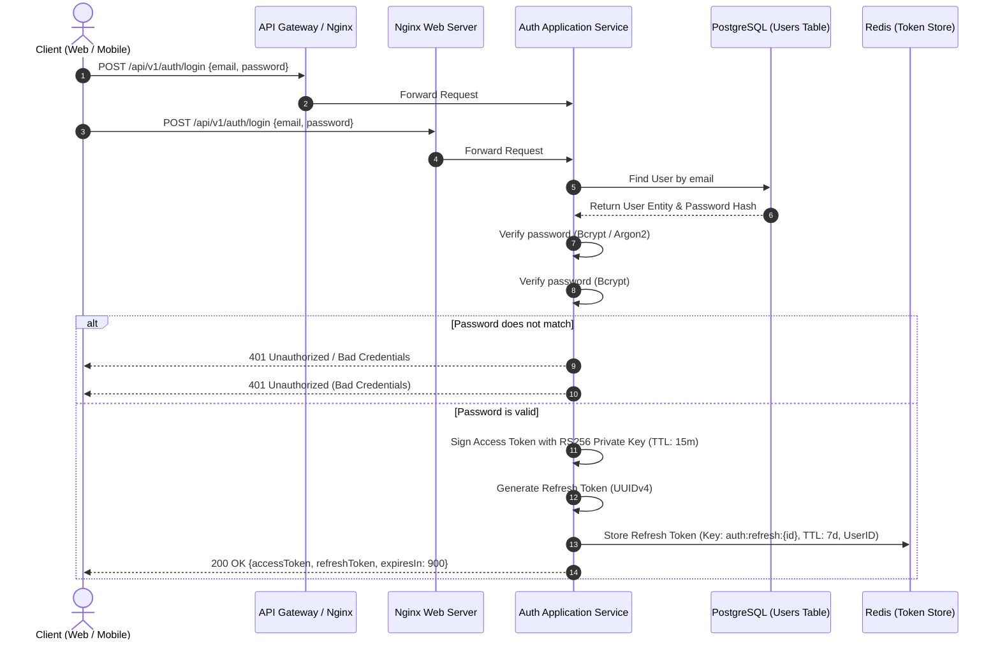
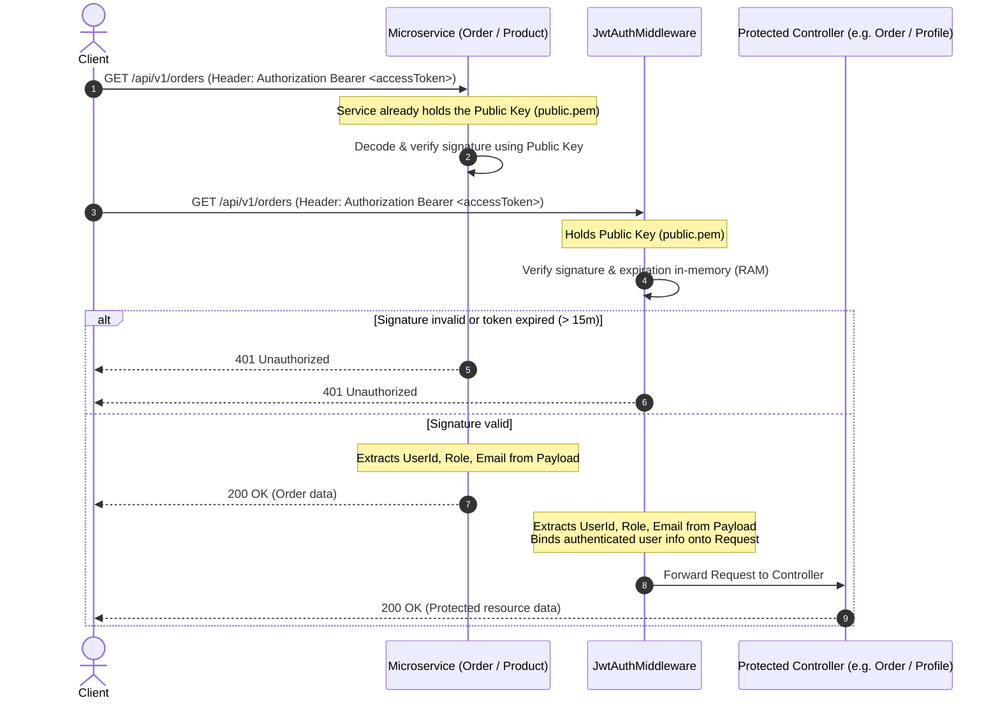
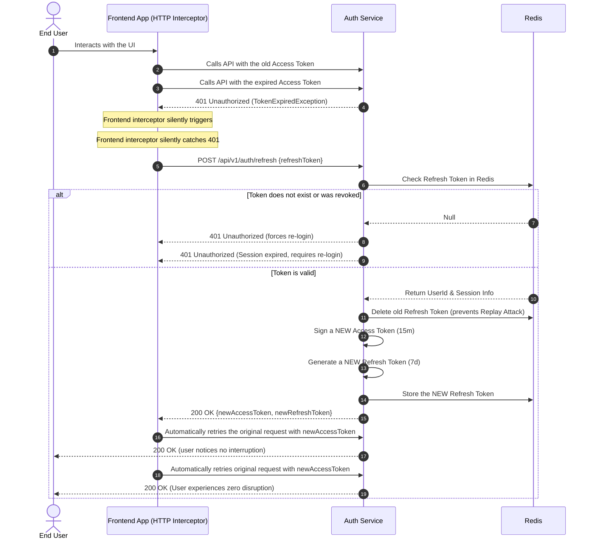
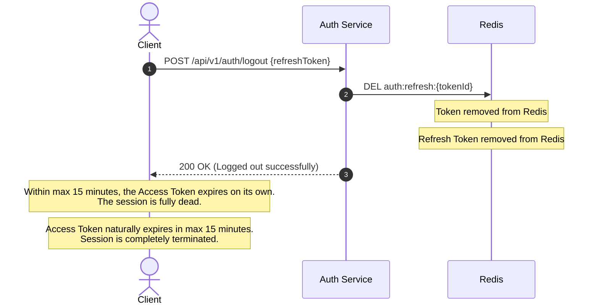

# 🔐 Use Case: JWT Authentication with Asymmetric Encryption (RS256) & Silent Refresh

> **Author:** Nguyen Huu Dai \
> **Role:** Backend Engineer \
> **Architecture Style:** Modular Domain-Driven Design \
> **Architecture Style:** Modular Monolith (Domain-Driven Design) \
> **Document Type:** Technical Design — Use Case Specification \
> **Last Updated:** September 11, 2026

Detailed design document for the user Authentication feature, using JSON Web Tokens (JWT) with **Asymmetric Encryption (RS256)**, a **dual-token strategy** (Access Token / Refresh Token), and a **Silent Refresh** mechanism, built following Clean Architecture / Domain-Driven Design (DDD) principles.
Detailed technical design for the user Authentication feature, using JSON Web Tokens (JWT) with **Asymmetric Encryption (RS256)**, a **dual-token strategy** (Access Token / Refresh Token), and a **Silent Refresh** mechanism, tailored for a **Modular Monolith** architecture following Clean Architecture / Domain-Driven Design (DDD) principles.

---

## 📋 Table of Contents

1. [Overview & Architecture Goals](#1--overview--architecture-goals)
2. [Token Lifecycle Strategy](#2--token-lifecycle-strategy)
3. [System Workflows](#3--system-workflows)
4. [DDD Structure](#4--ddd-structure)
5. [Key & Payload Specs](#5--key--payload-specs)
6. [Acceptance Criteria](#6--acceptance-criteria)

---

## 1. 🎯 Overview & Architecture Goals

### 1.1. Context & Problem

In an E-Commerce Modular Monolith system designed to scale toward Microservices:
In our E-Commerce **Modular Monolith** system:

- The **Authentication Service** is the single source of truth for user identity and access-rights issuance.
- **Downstream Services / API Gateway** (Product, Order, Payment, NestJS microservices) need to verify a user's access rights on **every single request**, with **ultra-low latency (< 1ms)**, **without creating a bottleneck** on the Auth Service or the central database.
- The **User / Auth Module** is the dedicated bounded context responsible for user identity, credential verification, and token issuance.
- **Protected Modules & Endpoints** (e.g., Order, Cart, Product, Profile) must authenticate every incoming request with **ultra-low latency (< 1ms)**.
- **The Challenge:** Traditional session or token checks often require querying the database on every single request (`SELECT * FROM users WHERE id = ...`), creating heavy database I/O bottlenecks as traffic grows.

### 1.2. Technical Goals

1. **🛡️ Maximum Security** — Apply asymmetric encryption **RS256 (RSA Signature with SHA-256)**.
    - **Private Key (`private.pem`)**: kept under strict protection; only the Auth Service holds it, used to **SIGN** tokens.
    - **Public Key (`public.pem`)**: freely distributed to the API Gateway and other microservices to **VERIFY** signatures. Even if the Public Key leaks, an attacker cannot forge a valid token signature.
2. **⚡ Stateless & Offline Verification** — Microservices use the Public Key to verify a token's signature entirely in RAM (< 1ms), with no network call back to the Auth Service.
3. **✨ Seamless UX** — Combine **Silent Refresh** with **Refresh Token Rotation (RTR)**, letting users stay logged in long-term without ever needing to log in again just because the Access Token expired.
4. **🚫 Instant Revocation** — Immediately revoke access when a user logs out, changes their password, or gets their account locked, via Redis.
5. **🛡️ Maximum Security via Separation of Concerns** — Apply asymmetric encryption **RS256 (RSA Signature with SHA-256)**.
    - **Private Key (`private.pem`)**: Strictly protected within the Auth module; only used to **SIGN** tokens during login and refresh.
    - **Public Key (`public.pem`)**: Used by the authentication middleware to **VERIFY** token signatures. Even if the Public Key is exposed, nobody can forge a token without the Private Key.
6. **⚡ Stateless In-Memory Verification** — Middleware verifies the token signature and extracts claims (UserId, Role, Email) entirely in RAM (< 1ms) using the Public Key, eliminating repetitive database queries on every protected route.
7. **✨ Seamless UX via Silent Refresh** — Combine **Silent Refresh** with **Refresh Token Rotation (RTR)**, allowing users to stay logged in continuously without interruption when the short-lived Access Token expires.
8. **🚫 Instant Revocation via Redis** — Retain the ability to instantly terminate sessions (logout, password change, account ban) by invalidating Refresh Tokens in Redis.

---

## 2. 🔁 Token Lifecycle Strategy

| Attribute                  | Access Token                                     | Refresh Token                                                                               |
| -------------------------- | ------------------------------------------------ | ------------------------------------------------------------------------------------------- |
| **Token type**             | Stateless JWT (RS256)                            | Stateful Opaque Token / UUIDv4 (or Signed JWT)                                              |
| **Lifetime (TTL)**         | **15 minutes** (short)                           | **7–14 days** (long)                                                                        |
| **Server-side storage**    | **None** (stateless)                             | **Redis** (`auth:refresh:{tokenId}`)                                                        |
| **Client-side storage**    | In-memory (React/Vue/App state) or Secure Cookie | `HttpOnly`, `Secure`, `SameSite=Strict` cookie                                              |
| **Blast radius if stolen** | Max 15 minutes of exposure                       | Controllable and instantly revocable in Redis                                               |
| **Rotation mechanism**     | Reissued every 15 minutes                        | **Refresh Token Rotation (RTR)** — old token invalidated, new token issued on every refresh |
| **Token type**             | Stateless JWT (RS256)                            | Stateful Opaque Token / UUIDv4                                                              |
| **Lifetime (TTL)**         | **15 minutes** (short-lived)                     | **7–14 days** (long-lived)                                                                  |
| **Server-side storage**    | **None** (stateless verification)                | **Redis** (`auth:refresh:{tokenId}`)                                                        |
| **Client-side storage**    | In-memory (App State) or Secure Cookie           | `HttpOnly`, `Secure`, `SameSite=Strict` Cookie                                              |
| **Blast radius if stolen** | Max 15 minutes of exposure                       | Instantly revocable in Redis                                                                |
| **Rotation mechanism**     | Reissued on each refresh                         | **Refresh Token Rotation (RTR)** — old token invalidated, new token issued on every refresh |

---

## 3. 🔄 System Workflows

### 3.1. Flow 1 — User Login



---

### 3.2. Flow 2 — Protected Resource Verification (Offline Verification)

### 3.2. Flow 2 — Protected Route Verification (In-Memory Verification)



> [!TIP]
> **Zero network calls** are made to the Auth Service or any intermediary database. Latency is measured in milliseconds, entirely in RAM.
> **Zero database queries** are performed to authenticate the request. Verification happens entirely in RAM using the Public Key, taking `< 1ms`.

---

### 3.3. Flow 3 — Silent Refresh with Rotation



---

### 3.4. Flow 4 — Logout & Revocation



---

## 4. 🧱 DDD Structure

Responsibilities are distributed across the four architectural layers:
Responsibilities are organized cleanly across the 4 Domain-Driven Design layers within our Modular Monolith:

```
ecommerce-scaling/
├── domain/
│   └── User/
│       ├── Entities/
│       │   └── UserEntity.php               # Manages state, id, credentials
│       │   └── UserEntity.php               # Manages user identity, credentials, status
│       └── Repositories/
│           └── UserRepositoryInterface.php   # findByEmail(), findById()
│
├── application/
│   └── User/
│       ├── Commands/
│       │   ├── LoginUserCommand.php         # DTO: email, password, ipAddress, userAgent
│       │   ├── RefreshTokenCommand.php      # DTO: refreshToken
│       │   └── LogoutUserCommand.php        # DTO: refreshToken
│       ├── Handlers/
│       │   ├── LoginUserHandler.php         # Verifies password, calls TokenService to create the token pair
│       │   ├── RefreshTokenHandler.php      # Validates refresh token, rotates in a new one
│       │   ├── LoginUserHandler.php         # Verifies password, delegates to TokenService
│       │   ├── RefreshTokenHandler.php      # Validates refresh token, rotates new token pair
│       │   └── LogoutUserHandler.php        # Revokes the refresh token in the store
│       ├── Contracts/
│       │   └── TokenServiceInterface.php    # Interface for signing and verifying tokens
│       │   └── TokenServiceInterface.php    # Application contract for signing and verifying tokens
│       └── DTOs/
│           └── TokenPairDTO.php             # accessToken, refreshToken, expiresIn, tokenType
│
├── infrastructure/
│   └── User/
│       ├── Security/
│       │   ├── Jwt/
│       │   │   ├── Rs256JwtService.php      # Concrete TokenServiceInterface implementation using RS256
│       │   │   ├── Rs256JwtService.php      # Concrete TokenServiceInterface implementation (RS256)
│       │   │   └── Keys/
│       │   │       ├── private.pem          # Private key (signs tokens) — NEVER commit to Git
│       │   │       └── public.pem           # Public key (verifies tokens)
│       │   └── Stores/
│       │       └── RedisRefreshTokenStore.php # Stores, checks, and deletes refresh tokens in Redis
│       └── Providers/
│           └── UserInfrastructureServiceProvider.php # Binds TokenServiceInterface -> Rs256JwtService
│
└── presentation/
    ├── User/
    │   ├── Controllers/
    │   │   └── AuthController.php           # login(), refresh(), logout(), me()
    │   └── Requests/
    │       ├── LoginRequest.php             # Validates email, password
    │       └── RefreshTokenRequest.php      # Validates refreshToken
    ├── Middleware/
    │   └── JwtAuthMiddleware.php            # Reads Bearer token, verifies via Public Key, binds User onto the Request
    │   └── JwtAuthMiddleware.php            # Reads Bearer token, verifies via Public Key, binds User onto Request
    └── Routes/
        └── api.php                          # Declares the /v1/auth/* endpoints
        └── api.php                          # Declares /v1/auth/* endpoints
```

---

## 5. 🔑 Key & Payload Specs

### 5.1. Access Token Payload Structure (RS256)

```json
{
    "iss": "ecommerce-auth-service",
    "iss": "ecommerce-api",
    "sub": "0191eb94-7b40-7e61-a876-c56b9c9f284e",
    "email": "customer@example.com",
    "role": "customer",
    "iat": 1726056000,
    "exp": 1726056900,
    "jti": "b5a932d8-4f1b-4ef9-813c-0e9e2b4f9810"
}
```

### 5.2. Generating the RSA Key Pair (2048-bit)

Run these OpenSSL commands in a secure environment:
Run these OpenSSL commands in a secure terminal:

```bash
# Generate the Private Key (PKCS#8)
openssl genrsa -out private.pem 2048

# Derive the Public Key from the Private Key
openssl rsa -in private.pem -pubout -out public.pem
```

> [!CAUTION]
>
> - The `private.pem` file must **never be committed to Git** (add it to `.gitignore`).
> - In Production (K8s/Docker), the Private Key must be delivered via Docker Secret, AWS Secrets Manager, or an environment variable (`JWT_PRIVATE_KEY_BASE64`).
> - The `private.pem` file must **never be committed to Git** (ensure it is ignored in `.gitignore`).
> - In Production (Docker / Cloud), the Private Key should be provided via Docker Secrets, Vault, or environment variables (`JWT_PRIVATE_KEY_BASE64`).

---

## 6. ✅ Acceptance Criteria

1. [ ] **Successful login** — Correct email and password returns HTTP 200 with an `accessToken` (RS256) and a `refreshToken`.
2. [ ] **Failed login** — Incorrect email or password returns HTTP 401 with a generic security message (does not reveal whether the email or the password was wrong).
3. [ ] **Valid Access Token verification** — Using the `accessToken` on a protected route (`/api/v1/auth/me`) returns the User's information.
4. [ ] **Expired Access Token verification** — After 15 minutes, the request returns HTTP 401.
5. [ ] **Token refresh** — A valid `refreshToken` returns a new token pair; the old `refreshToken` is deleted from Redis and cannot be reused.
6. [ ] **Logout** — Deletes the `refreshToken` from Redis; attempting to refresh with that token afterward is rejected.
7. [ ] **Performance** — Public Key verification in the middleware, processed in-memory, takes `< 1ms`.
8. [ ] **Failed login** — Incorrect email or password returns HTTP 401 with a generic message (does not disclose whether email or password was wrong).
9. [ ] **Valid Access Token verification** — Passing the `accessToken` to a protected route (`/api/v1/auth/me`) returns the user's details without querying the database for credentials.
10. [ ] **Expired Access Token verification** — After 15 minutes, requests return HTTP 401.
11. [ ] **Token refresh with rotation** — A valid `refreshToken` returns a new token pair; the old `refreshToken` is immediately invalidated in Redis.
12. [ ] **Logout** — Deletes the `refreshToken` from Redis; subsequent refresh attempts with that token fail with HTTP 401.
13. [ ] **Performance** — Public Key verification in `JwtAuthMiddleware` runs entirely in RAM in `< 1ms`.
